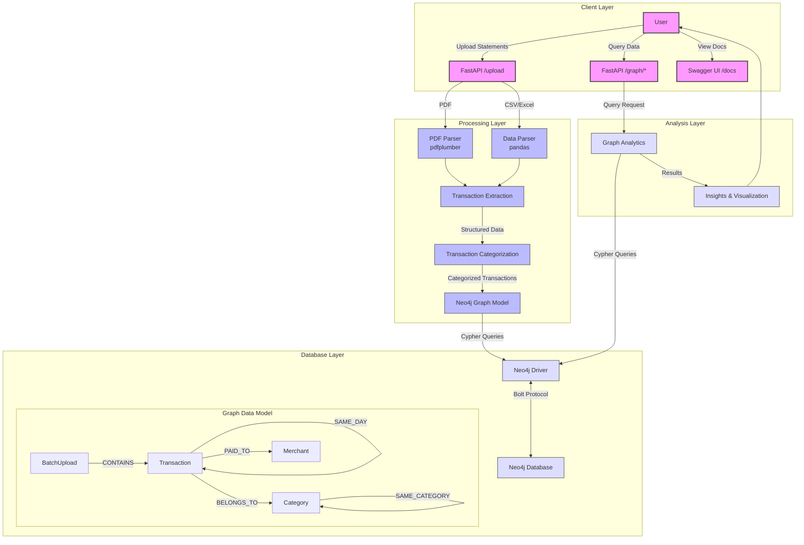

<file name=0 path=/Users/chakshitashetty/Desktop/My_protfolio/Finance/ai-finance-tracker/README.md>

###ai-finance-tracker
## Prerequisites

- Python 3.7 or higher
- Poetry for dependency management
- A running Neo4j instance (bolt://localhost:7687) and credentials
- (Optional) Docker if you prefer to run Neo4j in a container

## Installation

```bash
# Clone the repository
git clone https://github.com/Chaksh-8112/ai-finance-tracker.git
cd ai-finance-tracker

# Install dependencies via Poetry
poetry install
```

## Activating the virtual environment

After installing dependencies, activate the Poetry-managed shell:

```bash
poetry shell
```

If `poetry shell` does not work, manually activate the virtual environment with:

```bash
source $(poetry env info --path)/bin/activate
```

## Environment Setup

1. Create a `.env` file in the project root with the following variables:
   ```
   NEO4J_URI=bolt://localhost:7687
   NEO4J_USER=neo4j
   NEO4J_PASSWORD=yourPassword
   ```
2. Install PDF support if not already present:
   ```bash
   poetry add pdfplumber python-multipart
   ```

## Running the Server

```bash
# Start the FastAPI server with auto-reload
poetry run uvicorn app.main:app --reload
```

- The server will be available at `http://127.0.0.1:8000`.
- Interactive API docs: `http://127.0.0.1:8000/docs`

## Uploading a File

You can upload CSV, Excel, or PDF bank statements via the Swagger UI or `curl`:

- **Swagger UI**:  
  1. Open `http://127.0.0.1:8000/docs` in your browser.  
  2. Expand the **POST /upload** endpoint.  
  3. Click **Try it out**, choose your file, and execute.

- **cURL**:
  ```bash
  curl -F "file=@/path/to/statement.pdf" http://127.0.0.1:8000/upload
  ```

If `pdfplumber` is not found, ensure it is installed in your environment:
```bash
poetry add pdfplumber
```
Then restart the server.

## Verifying Uploads

Uploaded files are saved under `bank_statements/` in the project root for inspection. Check your console logs for the saved path.

<details>
<summary>High-Level Architecture (click to expand)</summary>


