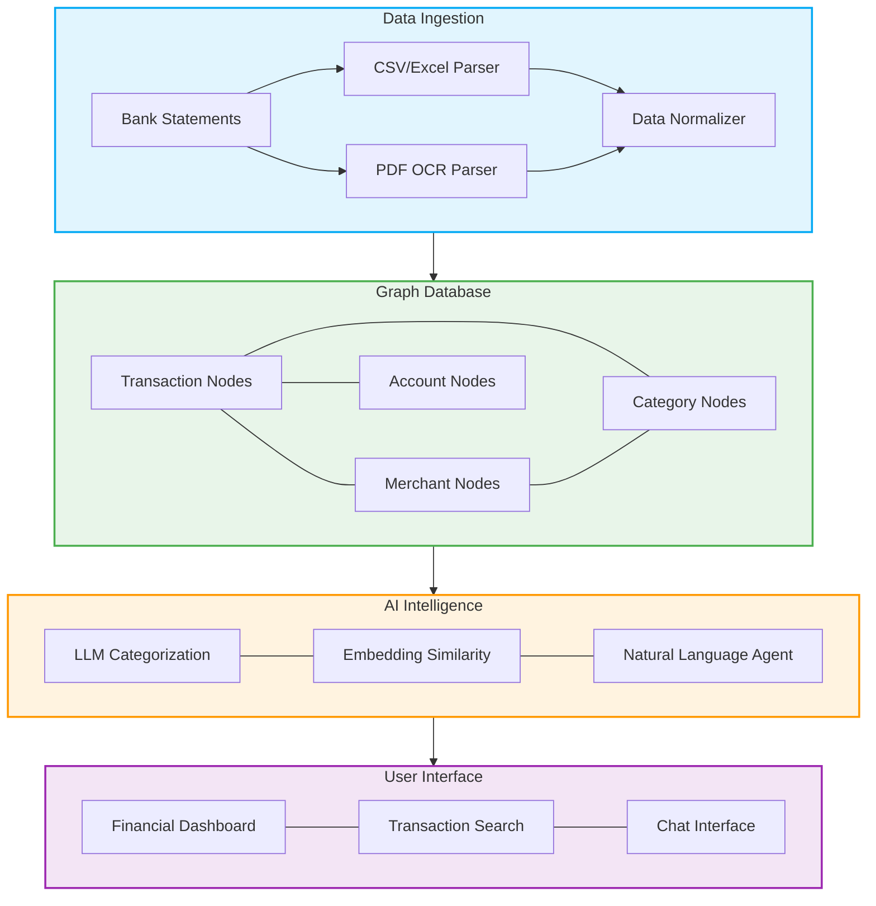

# Financial Graph AI

## Personal Finance Analysis with Graph Database, LLMs and Agents

Financial Graph AI is an open-source project that transforms personal bank statements into intelligent, queryable financial insights using graph database architecture and modern AI capabilities.

## System Architecture




## 🚀 Project Vision

Managing personal finances shouldn't require spreadsheet expertise or hours of manual categorization. Financial Graph AI automates the tedious parts of financial tracking while providing intelligent insights about spending patterns that traditional finance apps miss.

This project explores the intersection of structured financial data and contextual AI understanding through:

1. Graph-based financial modeling that captures relationships between transactions, merchants, categories and accounts
2. LLM-powered smart categorization that understands merchant descriptions better than rule-based systems 
3. Natural language querying that lets users ask questions about their finances in plain English

## 🏗️ Architecture Overview

### Core Components

```
┌─────────────────┐     ┌───────────────────┐     ┌─────────────────┐
│  Data Ingestion │     │  AI Intelligence  │     │  User Interface │
│  & Processing   │────>│  & Analytics      │────>│  & Experience   │
└─────────────────┘     └───────────────────┘     └─────────────────┘
```

### Data Pipeline

1. **Upload Interface**
   - Support for CSV, Excel and PDF bank statements
   - File validation and schema detection
   - Secure storage with encryption at rest

2. **Data Processing**
   - Transaction normalization (dates, amounts, descriptions)
   - PDF parsing with OCR for scanned statements
   - Deduplication and reconciliation

3. **Graph Database Modeling**
   - **Nodes**: Transaction, Merchant, Category, Account, Tag
   - **Relationships**: 
     - Transaction → Merchant (MADE_AT)
     - Transaction → Category (BELONGS_TO)
     - Account → Account (TRANSFERRED_TO/FROM)
     - Transaction → Tag (HAS_TAG)

4. **AI-Powered Features**
   - Smart categorization with LLM few-shot prompting
   - Similarity detection using transaction embeddings
   - Natural language querying with an AI agent

5. **Analytics Engine**
   - Weekly spending analysis and aggregation
   - Category-based trend detection
   - Anomaly detection (unusual spending patterns)

## 💻 Technology Stack

- **Backend**: Python (FastAPI/Flask), NodeJS (Express)
- **Frontend**: React, Next.js, Tailwind CSS
- **Databases**: 
  - Neo4j (graph database)
  - PostgreSQL (relational data)
  - Vector database (Pinecone/Weaviate)
- **AI & ML**:
  - LLMs (OpenAI API or local models)
  - LangChain for agent implementation
  - Embeddings for transaction similarity
- **Visualization**: D3.js, recharts

## 🌟 Unique Features

### 1. Graph-Powered Financial Intelligence

Unlike traditional financial apps that use flat tables, our graph model captures the rich relationships between transactions, revealing patterns like:

- Recurring subscription detection across varied description formats
- Merchant consolidation (identifying when different transaction descriptions are the same merchant)
- Financial flow mapping between accounts

### 2. Context-Aware Transaction Categorization

We combine traditional rule-based categorization with LLM intelligence to achieve significantly higher accuracy:

- Few-shot prompting teaches the model about ambiguous merchant descriptions
- Transaction similarity through embeddings finds patterns a rule engine would miss
- User feedback loop continuously improves categorization accuracy

### 3. Natural Language Financial Assistant

Ask questions about your finances in plain English:

- "How much did I spend on restaurants last month compared to the month before?"
- "What are my top 5 largest recurring expenses?"
- "Did I pay my rent twice this month?"

## 🔒 Security & Privacy

This project takes a "privacy-first" approach:

- All financial data remains on your infrastructure
- Optional LLM processing with local models (no data sent to third parties)
- End-to-end encryption for sensitive financial information
- No data sharing or analytics beyond your personal instance

## 🛣️ Project Roadmap

### Phase 1: Core Infrastructure
- Basic data ingestion for CSV/Excel
- Initial graph database implementation
- Simple categorization with rules

### Phase 2: AI Enhancement
- LLM-powered smart categorization
- Embedding-based transaction similarity
- Basic analytics dashboard

### Phase 3: Advanced Features
- Natural language query agent
- PDF statement support with OCR
- Anomaly detection
- Advanced visualizations

### Phase 4: Optimization & Scale
- Performance improvements
- Multi-user support
- API for external integrations

## 📊 Performance Goals

- Process 5 years of transactions in under 60 seconds
- Achieve >90% categorization accuracy without user intervention
- Query response time <500ms for typical financial questions

## 🤝 Contributing

This project welcomes contributions! Whether you're interested in improving the AI components, enhancing the graph model, or building better visualizations, please see our [CONTRIBUTING.md](CONTRIBUTING.md) guide.

## 📄 License

Financial Graph AI is available under the MIT License. See [LICENSE](LICENSE) for more information.

---

*Built with ❤️ by [Your Name], combining the power of graph databases and modern AI to revolutionize personal finance.*